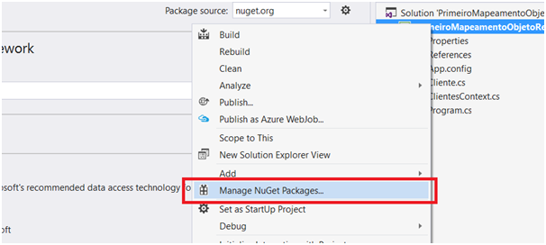
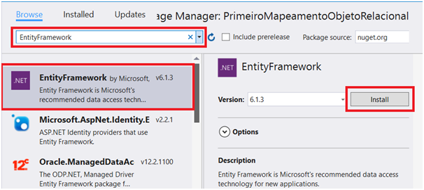

### Introdução

Banco de dados objeto-relacional (BDOR) ou sistema de gerenciamento de banco de dados relacional de objetos (SGBDRO), do inglês object-relational database (ORD) ou object-relational database management system (ORDBMS), é um sistema de gerenciamento de banco de dados (SGBD) semelhante a um banco de dados relacional, porém com um modelo de banco de dados orientado a objetos: objetos, classes e herança são suportados diretamente nos esquemas do banco de dados e na linguagem de consulta. Além disso, ele suporta extensão do modelo de dados com a personalização de tipos de dados e métodos.

A partir do SQL Server 2005 é possível utilizar o SQL Server como um banco OO através da criação de tipos personalizados criados no CLR e carregados para o SQL Server. Essa possibilidade extrapola a utilização dos User Defined Data Types (ou Alias Data Types). Ao invés de criarmos um tipo VARCHAR ou no máximo um tipo e-mail (VARCHAR com um número conhecido de posições), podemos utilizar um objeto como um Cliente por exemplo. A tabela poderia então conter não apenas uma coluna VARCHAR mas uma coluna do tipo Cliente onde a definição de seus atributos e métodos reside em um Assembly codificado em C# e tanto os métodos quanto os atributos podem ser utilizados em cláusula SQL.

Em todo caso, o fato do SQL Server dar algum suporte a esse tipo de construção não significa que ele é um banco orientado a objeto. Não adianta ter a casca parecida com o OO e o miolo continuar sendo relacional. O que ele está fazendo é apenas disponibilizando um ADD-IN para parecer-se com um banco de dados OO (diversos outros SGBDs também o fazem).

É certo que ter uma aplicação OO e um banco OO agiliza muito o desenvolvimento de aplicações visto que a persistência é transparente, ou seja, pode-se persistir as classes diretamente uma vez que a aplicação é OO e o banco é OO. Não haverá necessidade de converter diversos atributos de uma classe para colunas de uma, duas ou diversas tabelas.

Em todo caso, devemos lembrar que um objeto é uma unidade lógica composta de atributos e métodos e não podemos dissecá-lo. O objeto é aquilo e pronto. Não faz sentido repartí-lo em pedaços menores. Se levarmos esse pensamento para o banco de dados, seremos levado a pensar que aplicações que tenham esse mesmo raciocínio são ótimas candidatas a utilizar um banco OO. Aplicações de exames clínicos, aplicações de rádios, etc. As partes de um exame clínico dificilmente fazem sentido separadas (sempre desejar-se-á ter o exame como uma unidade). Uma música também segue o mesmo princípio.

Do outro lado temos os bancos de dados relacionais cuja a natureza normalizada faz com que os dados sejam repartidos por tantas tabelas. No caso das aplicações médicas e rádio teremos que sempre fazer JOINs para consultar os objetos como uma unidade, mas para aplicações transacionais típicas como um sistema de passagens aéreas ou uma aplicação bancária fará muito sentido tratar os dados de forma separada. Isso será vital para o desempenho.

Um dos grandes slogan do SQL Server 2008 é ir além do relacional. De fato ele já ultrapassou essa barreira quando possibilitou a implementação de cubos de dados, o armazenamento de imagens no banco (com devida indexação) e a implementação do XML que é um dado semiestruturado. A presença de dados geográficos só o torna de fato capaz de continuar indo além do relacional, mas por mais que ele esteja rodando as outras implementações não relacionais está com o pé mais fincado no mundo relacional do que qualquer outra coisa (e não acho que vá e nem que deva mudar por enquanto).


### Mapeamento Objeto-Relacional

ORM (Object-Relational Mapping) é uma técnica que consiste da conversão das classes da aplicação para tabelas do banco de dados e vice-versa. Da mesma forma, também faz parte desse processo a conversão entre os objetos da aplicação e as linhas da tabela. Ou seja, enquanto no código trabalhamos com classes e objetos, esses são gravados e recuperados do banco de dados na forma de registros/linhas.

Quando efetuamos esse processo manualmente, cabe a nós ler as linhas e colunas da tabela e preencher objetos e suas propriedades. No entanto, no .NET framework (assim como em outras linguagens) temos à disposição frameworks que se encarregam desse processo. Dessa forma, podemos trabalhar apenas com classes e objetos, sem escrever instruções SQL, e o framework faz todas as conversões necessárias para nós.

Neste microexemplo utilizaremos o Entity Framework, que é o principal framework ORM do ecossistema .NET. Confira abaixo o passo a passo de como proceder para efetuar seu primeiro Mapeamento Objeto-Relacional em C#. Para demonstrar esse processo partiremos de um projeto do tipo Console Application criado no Visual Studio.

#### Passo 1: Criar a classe de domínio

Normalmente em nossos sistemas precisaremos representar elementos do mundo real envolvidos no problema que queremos resolver com esse software. Por exemplo, em um sistema de automação comercial precisaremos representar entidades como Cliente, Produto, Fornecedor, etc. Essas são nossas classes de domínio.

Neste microexemplo criaremos uma classe chamada Cliente a partir da qual vamos persistir dados em uma tabela chamada Clientes no banco de dados. O código dessa classe pode ser visto abaixo:

```markdown
class Cliente
{
public int Id { get; set; }
public string Nome { get; set; }
public int Idade { get; set; }
public decimal Credito { get; set; }
}
```
A propriedade Id será usada como chave primária da tabela que será gerada no banco. Essa nomenclatura é >reconhecida por padrão pelo Entity Framework e em seu lugar poderia ser usado ClienteId;

Note que toda propriedade possui os métodos get e set, definidos de forma padrão/vazia. Isso é necessário para que o Entity Framework possa preencher essa propriedade dinamicamente com os dados vindos do banco.

#### Passo 2: Instalar o Entity Framework

O segundo passo para utilizar o Entity Framework é instalá-lo em nossa aplicação através do NuGet, que é o gerenciador de pacotes do ambiente .NET. Para fazer isso, clique com a direita sobre o projeto no Visual Studio e em seguida acesse o menu Manage NuGet Packages, como vemos na Figura 1.



Em seguida busque por EntityFramework e instale o pacote de mesmo nome, como ilustra a Figura 2.



A partir de agora poderemos usar as classes do framework para acessar o banco de dados.

#### Passo 3: Criar o DbContext

DbContext é uma classe central do Entity Framework. Ela representa uma abstração do banco de dados dentro da aplicação e é por meio dela que acessamos as tabelas (na forma de listas) e os registros (na forma de objetos).

Precisamos então criar uma nova classe que herdará de DbContext e aqui se chamará ClientesContext, como podemos ver a seguir:

```markdown
class ClientesContext:DbContext
{
public ClientesContext():base("BancoClientes")
{
} 
public DbSet<Cliente> Clientes { get; set; }
}
```
Linha 1: A classe deve herdar de DbContext, que pertence ao namespace System.Data.Entity e deve ser importado por meio da diretiva using;

Linha 3: Aqui invocamos o construtor da classe pai, passando como parâmetro o nome da string de conexão na qual essa classe encontrará as informações necessárias para se conectar ao banco de dados;

Linha 7: Aqui temos a definição da propriedade Clientes, que representará a tabela de mesmo nome no banco de dados. A classe DbSetrepresenta uma coleção de objetos que será mapeada como registros do banco de dados.

#### Passo 4: Criar a string de conexão

Como vimos anteriormente a classe ClientesContext faz referência à string de conexão chamada “BancoClientes”. A string de conexão, ou connection string, define as informações necessárias para conectar com o banco de dados. Por padrão ela é definida no arquivo App.config ou Web.config, da seguinte forma:

```markdown
<?xml version="1.0" encoding="utf-8"?>
<configuration>
<!-- demais elementos do XML -->
<connectionStrings>
<add name="BancoClientes"
connectionString="Data Source=.\SQLExpress;
Initial Catalog=DbClientes;
Integrated Security=True;"
providerName="System.Data.SqlClient" />
</connectionStrings>
</configuration>
```

Linha 4: As connection strings de uma aplicação devem estar dentro da seção connectionStrings no XML;

Linha 5: Cada string de conexão é criada com o elemento add, que possui vários atributos: name (o nome dessa string, que é o mesmo referenciado na classe DbContext), connectionString (a sequência de informações para acessar o banco - servidor, nome do banco e modo de autenticação) e providerName (a biblioteca de classes responsável por prover ao Entity Framework o acesso ao banco - nesse caso usamos a biblioteca do ADO.NET para SQL Server).

A partir de agora a classe ClientesContext já tem as informações necessárias para acessar o servidor do SQL Server, criar o banco e criar a tabela Clientes. Então podemos usá-la para gravar nosso primeiro registro, como veremos a seguir.

#### Passo 5: Gravar dados no banco

Agora que nossa aplicação já está configurada para efetuar o Mapeamento Objeto-Relacional, podemos criar um novo cliente e gravá-lo no banco de dados. Para isso utilizaremos o método Main da classe Program, da seguinte forma:

```markdown
static void Main(string[] args)
{
Cliente cli = new Cliente
{
Nome = "Joel",
Credito = 900,
Idade = 24
};

ClientesContext db = new ClientesContext();
db.Clientes.Add(cli);
db.SaveChanges();

Console.WriteLine("Cliente salvo com sucesso.");
Console.ReadKey();
}
```
Linhas 3 a 8: Criamos um objeto do tipo Cliente e preenchemos seus dados. Note que não preenchemos o Id, pois ele será gerado pelo banco de dados automaticamente;

Linhas 10 a 12: Instanciamos a classe ClientesContext e a partir dela adicionamos o novo cliente à lista e salvamos a operação com o método SaveChanges;

Linhas 14 e 15: Imprimimos uma mensagem no console e aguardamos o pressionamento de uma nova tecla para finalizar a aplicação.

#### Passo 6: Mostrar dados do banco

Agora que temos um dado em nosso banco, iremos fazer de uma forma simples para printar na tela.

```markdown
using (var ctx = new ClientesContext())
{
  client = ctx.Clientes.Where(s => s.Nome == "Joel").FirstOrDefault<Student>();
}
 
Console.WriteLine("Dados do usuário: " + client.Nome + " " + client.Credito + " " + client.Idade)
```
Linha 1 a 4: Vai até o banco e pega o cliente na tabela clientes cujo o nome é Joel.

Linha 6: Irá imprimir os dados que foram selecionados.

#### Passo 7: Alterar dados no banco

Agora que temos dados em nosso bancos, podemos alterar esses dados utulizando as seguintes linhas de codigos:

```markdown
using (var ctx = new ClientesContext())
{
  client = ctx.Clientes.Where(s => s.Nome == "Joel").FirstOrDefault<Student>();
}
  
if (client != null)
{
    client.Nome = "Joelzim";
}
  
using (var dbCtx = new ClientesContext())
{
    dbCtx.Entry(client).State = System.Data.Entity.EntityState.Modified;     
        
    dbCtx.SaveChanges();
}
```

Linha 1 a 4: Vai até o banco e pega o cliente na tabela clientes cujo o nome é Joel.

Linha 6 a 9: Faz a verificação para saber se aquele cliente está com o campo nome preenchido, caso esteja faz um "update" no campo nome.

Linha 11 a 16: No último bloco de comando ele salva as alterações realizadas no banco.

#### Passo 8: Deletar dados do banco.

Para finalizar nossa CRUD, a seguir irá mostrar um exemplo de código para deletar um dado dentro do banco.

```markdown
using (var ctx = new ClientesContext())
{
  clientToBeDeleted = ctx.Clientes.Where(s => s.Nome == "Joelzim").FirstOrDefault<Student>();
}
  
using (var dbCtx = new ClientesContext())
{
    dbCtx.Entry(clientToBeDeleted).State = System.Data.Entity.EntityState.Deleted;     
        
    dbCtx.SaveChanges();
}
```
Linha 1 a 4: Vai até o banco e pega o cliente na tabela clientes cujo o nome é Joelzim, da mesma forma que foi mostrado nos exemplos anteriores.

Linha 6 a 11: Faz a remoção dos dados que foram selecionados nas linhas 1 a 4 e salva(Commita) as alterações.


Se executarmos a aplicação agora veremos que o banco de dados será criado no SQL Server, bem como a tabela de Clientes e o registro será inserido e na sequência os demais exemplos para fazer READ, UPDATE e DELETE. Isso tudo foi feito utilizando poucas linhas de código e sem escrever instruções SQL, graças ao Mapeamento Objeto-Relacional feito pelo Entity Framework.

### Fontes:

http://www.deviamedia.com.br/

http://www.entityframeworktutorial.net/


### Feito por:
[Dario Gabriel](https://github.com/dariogabriel113)

[Hamilton Neto](https://github.com/hamiltonmneto)


### Visite: 
http://mbacefor.blogspot.com.br/
